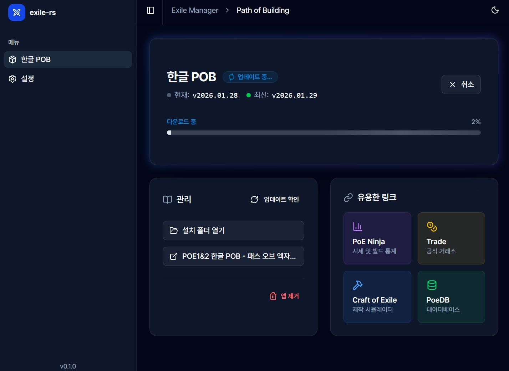

# exile-rs

A desktop application for managing Path of Exile tools and utilities.

## Features

- **PoB Manager**: Install and manage [Korean Path of Building](https://gall.dcinside.com/mgallery/board/view/?id=pathofexile&no=991032)
- **Version Control**: Automatically detect and manage different PoB versions

## Screenshots

<p align="center">
  
  <br>
  <em>Main Screen</em>
</p>

<p align="center">
  
  <br>
  <em>Installation Progress</em>
</p>

<p align="center">
  
  <br>
  <em>Installed</em>
</p>

## Download

Download the latest release from the [Releases](../../releases) page.

**Supported Platforms:**
- Windows (.msi, .exe installers)

## Development

### Prerequisites

- [Node.js](https://nodejs.org/) (with pnpm)
- [Rust](https://www.rust-lang.org/) (stable)
- [Tauri Prerequisites](https://v2.tauri.app/start/prerequisites/)

### Setup

```bash
# Install dependencies
pnpm install

# Run in development mode (with hot reload)
pnpm tauri dev

# Frontend only (SvelteKit dev server)
pnpm run dev

# Type check
pnpm run check
```

### Building

```bash
# Create production build
pnpm tauri build
```

The installer will be created in `src-tauri/target/release/bundle/`.

### Code Quality

Before committing, ensure your code passes all checks:

```bash
# Rust (from src-tauri/)
cargo fmt        # Format code
cargo clippy     # Lint
cargo test       # Run tests

# Frontend
pnpm run check   # Type check with svelte-check
```

## Project Structure

```
exile-rs/
├── src/                  # Frontend (Svelte)
│   ├── routes/          # SvelteKit pages
│   └── lib/
│       ├── bindings.ts  # Auto-generated Tauri commands
│       └── components/  # UI components
├── src-tauri/           # Backend (Rust)
│   └── src/
│       ├── commands.rs  # Tauri IPC commands
│       └── pob/         # PoB domain logic
└── .github/workflows/   # CI/CD
```

## Contributing

Contributions are welcome! Please ensure:

1. Code is formatted (`cargo fmt`, prettier for TS)
2. Lints pass (`cargo clippy`, `pnpm run check`)
3. Tests pass (`cargo test`)

## License

This project is licensed under the MIT License - see the [LICENSE](LICENSE) file for details.

## Acknowledgments

- [Path of Building](https://github.com/PathOfBuildingCommunity/PathOfBuilding)
- [PoeCharm](https://github.com/Chuanhsing/PoeCharm2)
- Built with [Tauri](https://tauri.app/)
